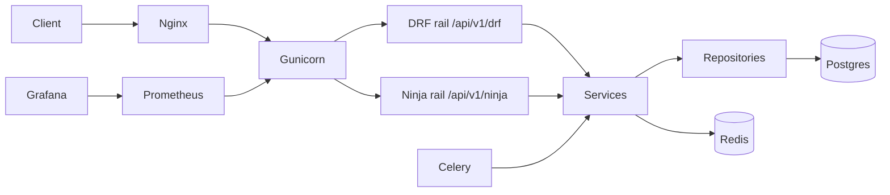

# CacheLayer — DRF vs Django Ninja Benchmark Platform

A production-grade Django backend that exposes the **same business
capabilities** through two API rails — Django REST Framework and Django
Ninja — so the two frameworks can be benchmarked, profiled and compared
on equal footing.

The repository is structured to read like a real backend product:
modular monolith, clean architecture, observability and deployment
included from day one.

> Built as a portfolio piece. Designed to communicate senior backend
> reasoning, not just working code.

## Table of Contents

- [Why this project exists](#why-this-project-exists)
- [Architecture at a glance](#architecture-at-a-glance)
- [Folder structure](#folder-structure)
- [Quickstart](#quickstart)
- [API Surface](#api-surface)
- [Benchmarking](#benchmarking)
- [Production deploy](#production-deploy)
- [Phases](#phases)
- [Mermaid diagrams](#mermaid-diagrams)
- [Interview talking points](#interview-talking-points)

## Why this project exists

Most "DRF vs Ninja" comparisons are unscientific: different routes,
different validation depth, different middleware stacks. This project
fixes that by:

- mounting both rails inside the **same** Django process,
- having both call the **same** services and repositories,
- enforcing payload-shape parity in tests,
- pinning data, cache state and process model when benchmarking.

What you can take away from the repo:

1. How to design a clean-architecture Django backend (apps / apis /
   services / repositories / schemas / core).
2. How to design a fair backend benchmark.
3. How to ship a production-grade deploy story (Docker, Nginx,
   Prometheus, Grafana, systemd, CI/CD).

## Architecture at a glance



See [docs/diagrams/](docs/diagrams) for the full set (System
architecture, Request flow, Auth flow, ER diagram, Service layer,
Repository pattern, API lifecycle, Caching, Background tasks,
Benchmarking pipeline, Deployment, CI/CD, Logging & Monitoring).

## Folder structure

```
.
├── CacheLayerBlog/        # Django project module (settings shim, wsgi, asgi, celery)
├── core/                  # Settings, middleware, logging, exceptions, observability
│   └── settings/{base,local,test,prod}.py
├── apps/                  # Domain code (framework-agnostic)
│   ├── users/             # Custom user with role enum
│   ├── catalog/           # Category, Product (+ seed_benchmark_data command)
│   └── orders/            # Order, OrderItem (+ celery tasks)
├── apis/                  # Transport rails
│   ├── drf/v1/            # DRF views, serializers, urls, permissions
│   └── ninja/v1/          # Ninja routers + JWT auth + exception handlers
├── services/              # Business logic (auth_service, product_service, order_service)
├── repositories/          # ORM access boundaries
├── schemas/               # Pydantic schemas for the Ninja rail
├── benchmarks/            # Locust + ApacheBench + pytest-benchmark
├── tests/                 # Unit, API and parity tests
├── scripts/               # entrypoint.sh, profilers, compare_rails.py
├── infra/                 # Docker, Nginx, Prometheus, Grafana, systemd
├── docs/
│   ├── phases/            # PHASE_{1..4}.md + PHASE_{1..4}_LEARNINGS.md
│   └── diagrams/          # 13 mermaid diagrams with reasoning
└── .github/workflows/     # ci.yml + deploy.yml
```

## Quickstart

```bash
# Clone, create env, bring up the dev stack.
cp .env.example .env
docker compose -f infra/docker/docker-compose.yml up --build -d

# Apply migrations + seed deterministic benchmark data.
docker compose -f infra/docker/docker-compose.yml exec app \
    python manage.py migrate
docker compose -f infra/docker/docker-compose.yml exec app \
    python manage.py seed_benchmark_data --reset --users 100 --products 500

# Verify both rails are alive.
curl -s http://localhost:8000/api/v1/drf/health/   | jq
curl -s http://localhost:8000/api/v1/ninja/health  | jq

# Run the test suite.
docker compose -f infra/docker/docker-compose.yml exec app pytest -q
```

## API Surface

Both rails are perfectly mirrored. The full table lives in
[docs/phases/PHASE_2.md](docs/phases/PHASE_2.md).

```
POST   /api/v1/{drf|ninja}/auth/register
POST   /api/v1/{drf|ninja}/auth/login
GET    /api/v1/{drf|ninja}/auth/me
GET    /api/v1/{drf|ninja}/products/
POST   /api/v1/{drf|ninja}/products/        (staff)
GET    /api/v1/{drf|ninja}/products/<sku>
PATCH  /api/v1/{drf|ninja}/products/<sku>/stock  (staff)
GET    /api/v1/{drf|ninja}/orders/
POST   /api/v1/{drf|ninja}/orders/
GET    /api/v1/{drf|ninja}/orders/<id>
PATCH  /api/v1/{drf|ninja}/orders/<id>/status    (staff)
```

All errors share an envelope:

```json
{
  "error": {
    "code": "conflict",
    "message": "Insufficient stock",
    "details": {"sku": "SKU-1", "requested": 5, "available": 2}
  },
  "request_id": "ab12...e9"
}
```

## Benchmarking

```bash
# Disable rate limit + heavy logging for the duration of the run.
export BENCHMARK_MODE=true

# Reset to a known dataset.
python manage.py seed_benchmark_data --reset --seed 42

# Quick smoke (ApacheBench)
./benchmarks/ab/run_ab.sh

# Sustained run (Locust headless, both rails simultaneously)
./benchmarks/locust/run.sh                 # 200 users, 60s
HOST=http://localhost:8000 USERS=500 DURATION=300s ./benchmarks/locust/run.sh

# Micro-benchmarks (validation + serialization only)
pytest -m benchmark --benchmark-only --benchmark-save=phase3
```

Reports land in `benchmarks/reports/<timestamp>/`. The full methodology
(why we pin dataset / cache / process model) is in
[docs/phases/PHASE_3.md](docs/phases/PHASE_3.md).

## Production deploy

Single VPS via Docker Compose + systemd:

```bash
# On the VPS
sudo cp infra/systemd/cachelayer.service /etc/systemd/system/
sudo systemctl daemon-reload
sudo systemctl enable --now cachelayer
```

Stack (production compose file is `infra/docker/docker-compose.prod.yml`):

| Service | Role |
|---|---|
| `nginx` | Edge: TLS, rate limit, security headers |
| `app` | Gunicorn + Django |
| `worker` | Celery worker |
| `beat` | Celery beat scheduler |
| `db` | Postgres |
| `redis` | Cache + broker |
| `prometheus` | Metrics scrape |
| `grafana` | Dashboards (provisioned) |

See [docs/phases/PHASE_4.md](docs/phases/PHASE_4.md) for the full
runbook, security checklist and SLOs.

## Phases

Each phase is documented as a runbook + a learnings file:

| Phase | Topic | Doc | Learnings |
|---|---|---|---|
| 1 | Foundation & Architecture | [PHASE_1.md](docs/phases/PHASE_1.md) | [PHASE_1_LEARNINGS.md](docs/phases/PHASE_1_LEARNINGS.md) |
| 2 | Core APIs & Business Logic | [PHASE_2.md](docs/phases/PHASE_2.md) | [PHASE_2_LEARNINGS.md](docs/phases/PHASE_2_LEARNINGS.md) |
| 3 | Benchmarking & Performance | [PHASE_3.md](docs/phases/PHASE_3.md) | [PHASE_3_LEARNINGS.md](docs/phases/PHASE_3_LEARNINGS.md) |
| 4 | Production Engineering | [PHASE_4.md](docs/phases/PHASE_4.md) | [PHASE_4_LEARNINGS.md](docs/phases/PHASE_4_LEARNINGS.md) |

## Mermaid diagrams

13 architecture diagrams under [docs/diagrams/](docs/diagrams):

1. [System Architecture](docs/diagrams/01_system_architecture.md)
2. [Request Flow](docs/diagrams/02_request_flow.md)
3. [Authentication Flow](docs/diagrams/03_authentication_flow.md)
4. [Database ER](docs/diagrams/04_database_er.md)
5. [Service Layer Flow](docs/diagrams/05_service_layer.md)
6. [Repository Pattern Flow](docs/diagrams/06_repository_pattern.md)
7. [API Lifecycle](docs/diagrams/07_api_lifecycle.md)
8. [Caching Flow](docs/diagrams/08_caching_flow.md)
9. [Background Task Flow](docs/diagrams/09_background_tasks.md)
10. [Benchmarking Pipeline](docs/diagrams/10_benchmarking_pipeline.md)
11. [Deployment Architecture](docs/diagrams/11_deployment_architecture.md)
12. [CI/CD Pipeline](docs/diagrams/12_cicd_pipeline.md)
13. [Logging & Monitoring](docs/diagrams/13_logging_monitoring.md)

## Interview talking points

Use these as conversation seeds:

- "How did you keep DRF vs Ninja comparable in a benchmark?"
- "Where does business logic live, and why?"
- "How does your system survive a pod restart mid-request?"
- "What changes if Postgres becomes the bottleneck?"
- "How do you guarantee the two rails return identical payloads?"
- "What does graceful shutdown look like in your container?"
- "Where would you draw the line for Kubernetes vs Compose?"

The full list lives in each phase doc under "Interview Talking Points".

## License

For portfolio / educational use. Adapt to your own contexts.
