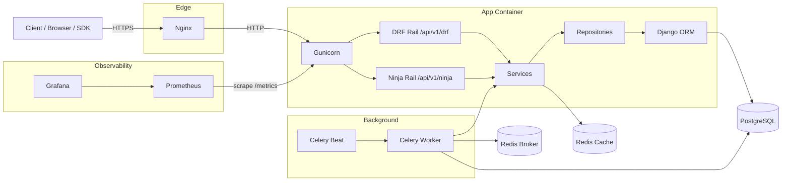

# System Architecture

## Explanation

The platform is a modular Django monolith that exposes the same business
capabilities through two API rails (DRF and Django Ninja). All state
lives in Postgres; Redis serves the cache and the Celery broker. Nginx
terminates the edge, applies rate limiting and forwards to Gunicorn.
Prometheus scrapes per-rail latency metrics; Grafana visualises them.

## Diagram

## Real-world reasoning

- One Django process holds both rails so the only difference between
  them in any benchmark is the framework itself.
- Cache and broker share Redis but use different DBs (`/0` and `/1`)
  for isolation.

## Scaling considerations

- App container is stateless; replicate horizontally behind Nginx.
- Postgres is the natural bottleneck; add a read replica before adding
  more app replicas.
- Redis can be sharded by key (cache vs broker) when memory pressure
  rises.

## Possible bottlenecks

- DB connection pool exhaustion under burst traffic.
- Single Nginx instance saturating CPU at very high RPS.

## Optimization ideas

- pgBouncer in front of Postgres.
- Pre-fork connection reuse via `CONN_MAX_AGE` tuning.
- Serve static files directly from Nginx, not Gunicorn.
