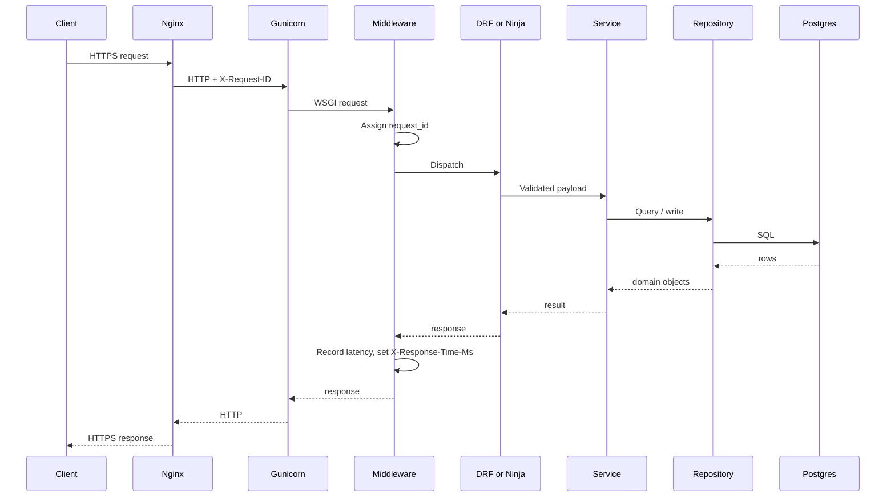

# Request Flow

## Explanation

How a single API request flows through the system, regardless of rail.

## Diagram

## Real-world reasoning

- Putting the request id at the edge (Nginx) and propagating into the
  app gives you one correlation id end-to-end.
- The middleware-only timing means DRF and Ninja are measured by the
  exact same clock.

## Scaling considerations

- The path is shallow; per-request overhead is dominated by API +
  Service + DB.
- N+1 queries explode this picture by adding extra rows of `R-->DB`.

## Possible bottlenecks

- Service holding a transaction longer than necessary.
- Repository forgetting `select_related` causing N+1.

## Optimization ideas

- Capture `connection.queries` count per request and log when it exceeds
  a threshold.
