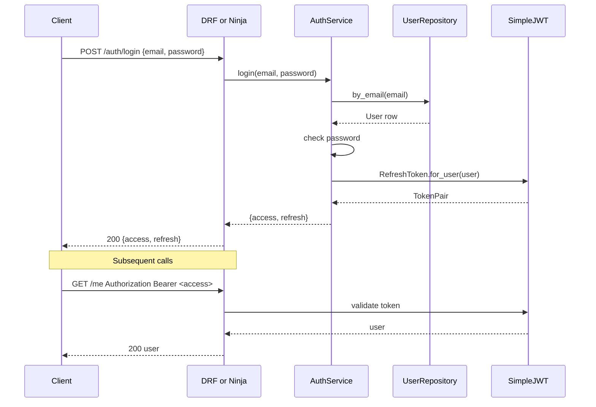

# Authentication Flow

## Explanation

Both rails issue and validate tokens via the same SimpleJWT primitives so
clients are interchangeable.

## Diagram

## Real-world reasoning

- One issuer + one validator across both rails removes a class of bugs
  ("DRF accepts this token, Ninja rejects it").
- Refresh rotation is enabled to limit replay risk.

## Scaling considerations

- JWTs are stateless: any app replica can validate without a session
  store. That's why they fit horizontal scaling well.

## Possible bottlenecks

- Password hashing CPU on registration spikes.

## Optimization ideas

- Move heavy registration validation to a Celery task once registration
  is no longer in the synchronous path.
