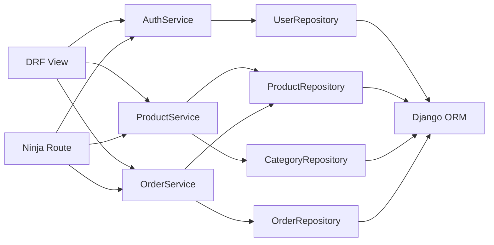

# Service Layer Flow

## Explanation

Both rails call into the same service. The service owns the rules.

## Diagram

## Real-world reasoning

- A new endpoint needs *only* a new view + serializer. Business rules
  do not move.
- A bug in stock decrement is fixed in *one* place.

## Scaling considerations

- Services are pure-Python; cheap to wrap in async or move into a
  worker if load demands it.

## Possible bottlenecks

- Service method that does N round-trips. Track via Prometheus
  `clb_service_calls_total`.

## Optimization ideas

- Bulk operations on the service surface (e.g. `place_orders([..])`)
  for batch flows.
