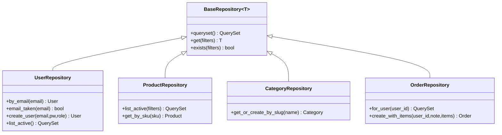

# Repository Pattern Flow

## Explanation

The repository is the only layer that touches `Model.objects`. It owns
query plans (`select_related`, `prefetch_related`, indexes).

## Diagram

## Real-world reasoning

- Centralising queries makes performance reviews tractable.
- Swapping the cache layer or moving to a read-replica is a one-file
  change inside the repository.

## Scaling considerations

- `select_related("category")` on `ProductRepository.queryset()`
  prevents N+1 in list views.

## Possible bottlenecks

- A repo method returning a raw `QuerySet` that's later filtered
  outside it (loses query plan ownership).

## Optimization ideas

- Add `count()` short-circuits using indexed columns only.
- Separate read and write repositories when the model warrants it.
