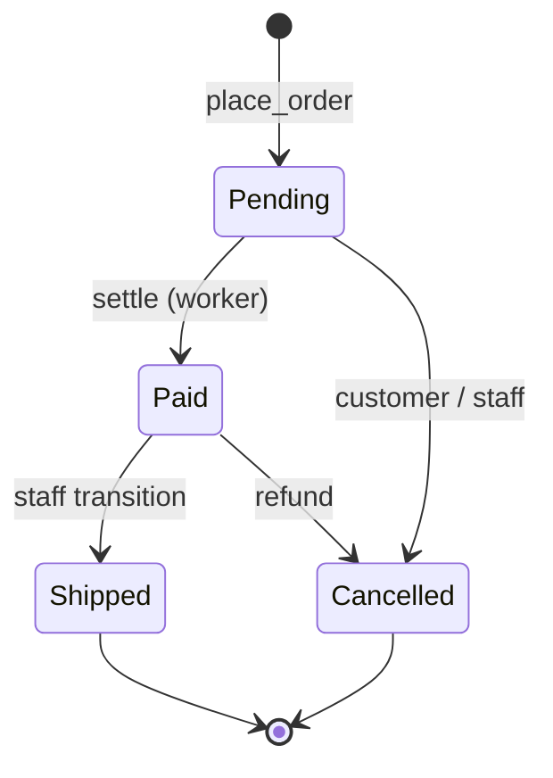

# API Lifecycle

## Explanation

State transitions of an order, the most lifecycle-rich resource.

## Diagram

## Real-world reasoning

- Modeling order status as an explicit state machine prevents illegal
  transitions ("shipped" -> "pending").
- The `OrderService.transition` gate enforces RBAC + valid moves.

## Scaling considerations

- Background settlement decouples checkout from payment provider
  latency.

## Possible bottlenecks

- A growing `Pending` queue indicates a payment-provider stall.

## Optimization ideas

- Emit transition events to a queue for async fulfillment systems.
