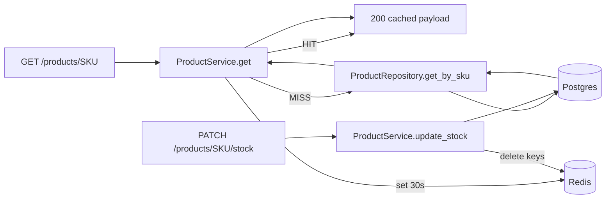

# Caching Flow

## Explanation

Read cache for product detail with explicit invalidation.

## Diagram

## Real-world reasoning

- Cache reads, never writes.
- Invalidate on the write path so stale values are bounded by the
  shorter of `TTL` and "next write".

## Scaling considerations

- Use cache prefix (`clb`) so shared Redis instances stay separable.
- Bounded TTL caps the worst-case staleness even if invalidation is
  missed.

## Possible bottlenecks

- Thundering herd on cache expiry. Add a small jitter to TTLs.

## Optimization ideas

- Tag-based invalidation (`cache.delete_many` by pattern) for bulk
  product imports.
