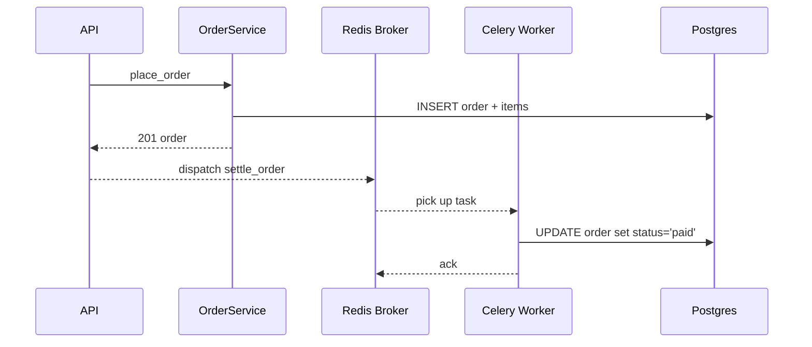

# Background Task Flow

## Explanation

Celery worker handles deferred work. The example here is order
settlement, but the pattern is general.

## Diagram

## Real-world reasoning

- The API stays sub-second by deferring slow side effects.
- Tasks are idempotent so a redelivery doesn't double-charge.

## Scaling considerations

- Worker concurrency is independent from web concurrency.
- Beat schedules periodic jobs (cleanups, aggregations).

## Possible bottlenecks

- Tasks blocking on external APIs without timeouts.

## Optimization ideas

- Per-task rate limits via Celery `rate_limit`.
- Dead-letter queue for repeated failures.
