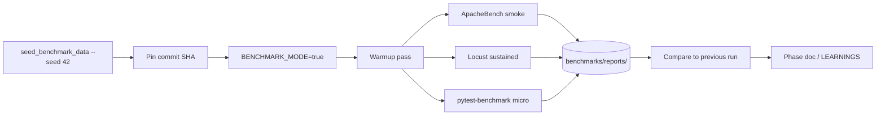

# Benchmarking Pipeline

## Explanation

How we generate reproducible numbers comparing DRF vs Ninja.

## Diagram

## Real-world reasoning

- Each step is pinned (dataset, mode, warm state) so two runs are
  comparable.

## Scaling considerations

- Run the load generator from a separate machine to remove "client
  steals CPU" effects.

## Possible bottlenecks

- Locust running from the same VM as the app distorts results.

## Optimization ideas

- Trend dashboard from `--benchmark-save` JSON across commits.
