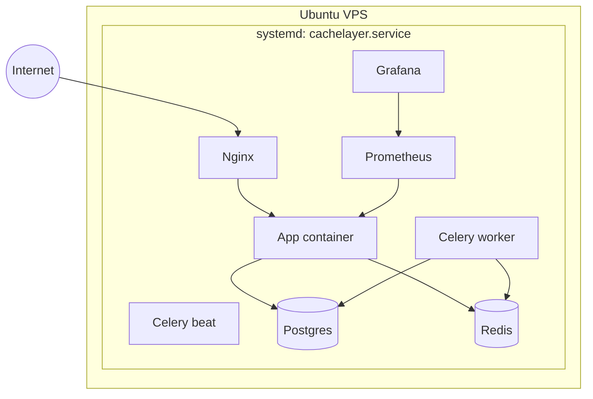

# Deployment Architecture

## Explanation

Single VPS deployment using Compose + systemd, the exact stack documented
in Phase 4.

## Diagram

## Real-world reasoning

- Compose + systemd gives auto-restart and on-boot startup without a
  cluster.
- Ports 80/443 are the only public ones; the rest stay on the docker
  network.

## Scaling considerations

- Move Postgres to a managed service for HA when it becomes the SPOF
  that hurts.
- Add an LB and replicate the `app` container before the box itself
  saturates.

## Possible bottlenecks

- Single VPS = single failure domain. Acceptable for portfolio /
  staging only.

## Optimization ideas

- Replace this stack with a Kubernetes baseline (Deployments, HPA,
  Ingress) when traffic justifies it.
