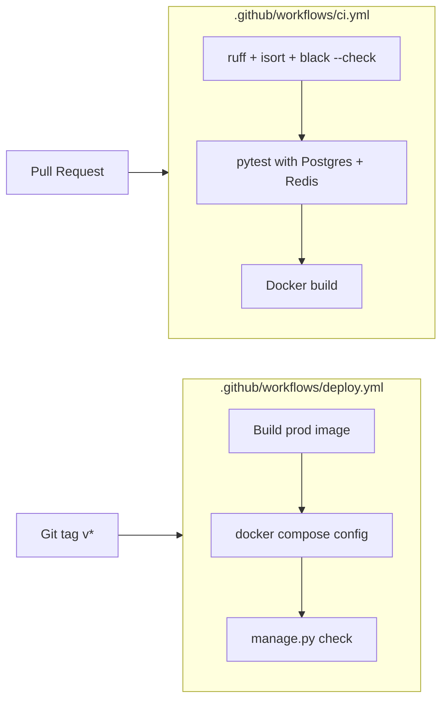

# CI/CD Pipeline

## Explanation

GitHub Actions runs lint, tests, image build on every PR; deploy
simulation runs on tag.

## Diagram

## Real-world reasoning

- Lint failing fast saves human review cycles.
- Image build in CI catches Dockerfile drift before the host does.

## Scaling considerations

- Cache layer with `cache-from/cache-to: type=gha` keeps build minutes
  bounded as the project grows.

## Possible bottlenecks

- Long test suites starve the runner pool. Split into matrix jobs.

## Optimization ideas

- Add a release job that pushes to a registry and a deploy job that
  SSHes to the VPS and `systemctl restart cachelayer`.
