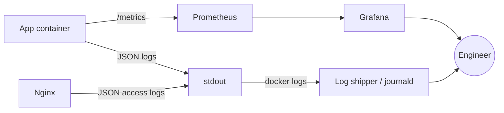

# Logging & Monitoring Flow

## Explanation

How signals leave the app and reach a human.

## Diagram

## Real-world reasoning

- JSON everywhere = grepable, parseable, alertable without writing
  parsers.
- Same `request_id` in app logs, Nginx logs and downstream services.

## Scaling considerations

- Replace stdout with Loki / Cloud logging for long retention.
- Add tracing (OpenTelemetry) once you have multiple services worth
  joining.

## Possible bottlenecks

- High-cardinality labels in Prometheus (e.g. per-user labels) blow up
  memory.

## Optimization ideas

- Per-rail histograms (`clb_rail_latency_seconds`) but never per-user.
- Sampling on hot endpoints if logs are too noisy.
